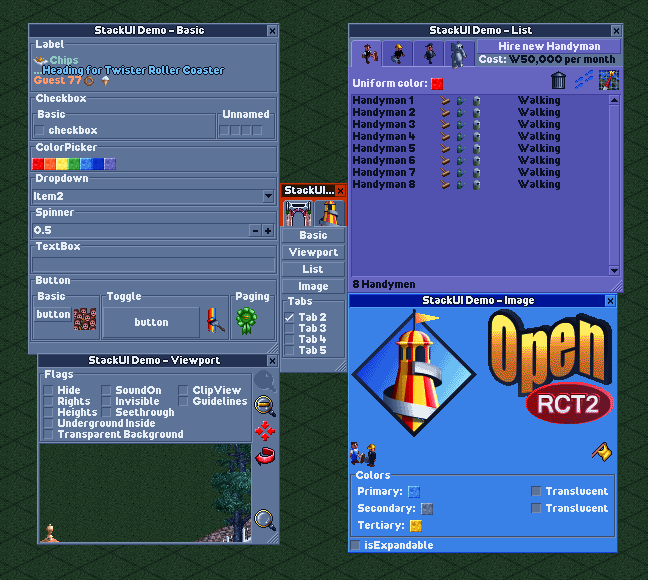
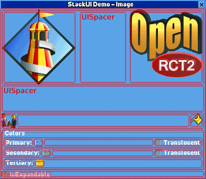
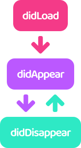
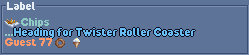

<p align="center">

<br /><br />


<br /><br />
✨ Easy-to-use UI framework for OpenRCT2 plugin developer.
<a href="README_ko.md"><strong>[Korean]</strong></a>
</p>
<br /><br /><br />

## ✨ Getting Started

1. Fork this repository. (It can be used as a base template for creating plugins.)
2. Clone the forked repository in the directory reserved for development.
3. Download file [openrct.2.d.ts](https://github.com/OpenRCT2/OpenRCT2/tree/develop/distribution/openrct2.d.ts) and put it in directory `.../modules`.
4. Start developing your plugins in the directory `.../develop`.

<br />

## 🌍 Demo



Most of the usage examples are included in the demo plugin.

See file `plugin.ts` in directory `.../develop`.

<br />

## ⚙ Development

Read more about development below.

<details>
<summary><strong>🎢 Process</strong></summary>

Plugin development using StackUI consists of the following steps.

1. Construct a window

```tsx
//Constructs a single tabbed window with a blank label.
UIWindow.$(
    UITab.$(
        UILabel.$("")
    )
);
```

2. Preparing and setting up initial data

```tsx
//Define and set the information to be displayed in the initial window.
const text = "Label";

UIWindow.$(
    UITab.$(
        UILabel.$(text)
    ).image(UIImageTabGears)
).title("Window");
```

3. Defining Proxies

```tsx
//Defines proxies for passing commands to the UI and responding to actions.
const windowProxy = UIWDP.$();
const labelProxy = UIWP.$<UILabel>();

const text = "Label";

UIWindow.$(
    UITab.$(
        UILabel.$(text)
    ).image(UIImageTabGears)
).title("Window");
```

4. Binding Proxy

```tsx
const windowProxy = UIWDP.$();
const labelProxy = UIWP.$<UILabel>();

const text = "Label";

//Bind the proxy to the UI.
UIWindow.$(
    UITab.$(
        UILabel.$(text).bind(labelProxy)
    ).image(UIImageTabGears)
).bind(windowProxy)
.title("Window");
```

5. Binding UI Actions

```tsx
const windowProxy = UIWDP.$();
const labelProxy = UIWP.$<UILabel>();

const text = "Label";

UIWindow.$(
    UITab.$(
        UILabel.$(text).bind(labelProxy)
    ).image(UIImageTabGears)
).bind(windowProxy)
.title("Window");

//Write code to run based on UI actions.
windowProxy.didAppear((window) => {
    console.log(window.getTitle());
    console.log(`before: ${labelProxy.ui?.getText()}`);
    labelProxy.updateUI((label) => {
        label.title(`${window.getTitle()} is opened.`);
    });
    console.log(`after: ${labelProxy.ui?.getText()}`);
});
```

6. Open window

```tsx
const windowProxy = UIWDP.$();
const labelProxy = UIWP.$<UILabel>();

const text = "Label";

UIWindow.$(
    UITab.$(
        UILabel.$(text).bind(labelProxy)
    ).image(UIImageTabGears)
).bind(windowProxy)
.title("Window");

windowProxy.didAppear((window) => {
    console.log(window.getTitle());
    console.log(`before: ${labelProxy.ui?.getText()}`);
    labelProxy.updateUI((label) => {
        label.title(`${window.getTitle()} is opened.`);
    });
    console.log(`after: ${labelProxy.ui?.getText()}`);
});

//Open a window based on the above.
windowProxy.show();
```
---
</details>

<details><summary><b>📄 Documents</b></summary>

---

<details><summary><b>💠 UIWindow</b></summary>

- $: Initialize with widget list
- $T: Initialize with tab list

Property
- spacing
- padding
- origin
- minSize
- maxSize
- isExpandable
- title
- selectedTabIndex
- selectedTabName
- theme

Action
- show
- updateUI
- close
- bringToFront
- findWidget
- bind
- getUITab
- getUIWidget

Handler
- onClose
- onTabChange
- didLoad
- didAppear
- didDisappear

</details>
<details><summary><b>📑 UITab</b></summary>

- $: Initialize with widget list

Property
- name
- spacing
- padding
- isExpandable
- minSize
- maxSize
- image
- title
- theme
- isHidden

Action
- updateUI
- bind
- getUIWidget

Handler
- didLoad
- didAppear
- didDisappear

</details>
<details><summary><b>🧒 UIWidget</b></summary>

Property
- origin
- offset
- extends
- size
- minSize
- occupiedSize
- name
- tooltip
- isDisabled
- isVisible
- font
- description

Action
- updateUI
- bind
- resetSize

Handler
- didLoad
- didAppear
- didDisapp

Drived widget

<details><summary><b>🛹 UIStack</b></summary>

- $: Initialize with widget list
- $V: Initialize the widget list by placing it vertically
- $H: Initialize the widget list by placing it horizontally
- $VG: Initialize by arranging the widget list vertically, and display the group box
- $HG: Initialize by arranging the widget list horizontally, and display the group box

Property
- axis
- spacing
- padding
- isGrouped
- title
- childs

</details>
<details><summary><b>🏷️ UILabel</b></summary>

- $: Initialize with string

Property
- align
- text

Handler
- onChange

</details>
<details><summary><b>🌌 UISpacer</b></summary>

- $: Initialize with spacing value

Property
- axis
- spacing

</details>
<details><summary><b>🔘 UIButton</b></summary>

- $: Initialize to text
- $I: Initialize to image

Property
- border
- image
- isPressed
- title

Action
- isImageEqual

Handler
- onClick

Derived widget
<details><summary><b>🔲 UIToggleButton</b></summary>

Action
- toggle

Handler
- onPress

</details>
<details><summary><b>🔄 UIPageImageButton</b></summary>

- $IP: Initialize with image list

Action
- images
- currentIndex

Handler
- onPage

</details>

---

</details>
<details><summary><b>🔁 UISpinner</b></summary>

- $: Initialize to default value

Property
- range
- step
- fixed
- value
- formatter

Action
- dialogueInfo

Handler
- onChange

</details>
<details><summary><b>✅ UICheckbox</b></summary>

- $: Initialize to title
- $UN: Initialize without title

Property
- isChecked
- text

Action
- toggle

Handler
- onChange

</details>
<details><summary><b>🔽 UIDropdown</b></summary>

- $: Initialize with string list

Property
- items
- selectedIndex

handler
- onChange

</details>
<details><summary><b>🔳 UIColorpicker</b></summary>

- $: Initialize to color

Property
- color

Handler
- onChange

</details>
<details><summary><b>🖼️ UIImageView</b></summary>

- $: Initialize to image

Property
- image
- theme

</details>
<details><summary><b>🎑 UIViewport</b></summary>

- $: Initialize to default value

Property
- position
- rotation
- zoom
- flags
- centerPosition

Action
- moveTo
- scrollTo
- scrollToMainViewportCenter
- moveToMainViewportCenter
- mainViewportScrollToThis

</details>
<details><summary><b>📃 UIListView</b></summary>

- $: Initialize with column list

Property
- scrollbarType
- isStriped
- showColumnHeaders
- selectedCell
- canSelect
- columnData
- itemData
- highlightedCell
- columns
- items

Action
- addColumn(s)
- addItem(s)
- clearAllItems

Handler
- onHighlight
- onClick

Child element
<details><summary><b>🏷️ UIListViewColumn</b></summary>

- $: Initialize to default width
- $F: Initialize to fixed column width
- $R: Initialize to range column width
- $W: Initialize to percentage column width

Property
- sortOrder
- canSort
- tooltip

</details>
<details><summary><b>⚪ UIListViewItem</b></summary>

- $: Initialize with string list
- $S: Initialize to string as separator

Property
- isSeparator
- elements

</details>

---

</details>
<details><summary><b>📄 UITextbox</b></summary>

- $: Initialize to string

Property
- text
- maxLength

Handler
- onChange

</details>

---

</details>

<details><summary><b>🛰️ UIProxy</b></summary>

- $: Default Initializer

Property
- ui

Action
- updateUI

Handler
- didLoad
- didAppear
- didDisappear

Derived proxy
<details><summary><b>💠 UIWindowProxy (UIWDP)</b></summary>

Action
- show
- close

Handler
- onTabChange
- onClose

</details>

<details><summary><b>📑 UITabProxy (UITP)</b></summary>
</details>

<details><summary><b>🧒 UIWidgetProxy (UIWP)</b></summary>

Handler
- onClick
- onChange

</details>

---

</details>

<details><summary><b>🖼️ UIImage</b></summary>

- $: Initialize to single image
- $A: Initialize as a continuous image
- $F: Initialize with non-contiguous images

Property
- isAnimatable
- duration
- offset
- singleFrame
- size
- description
- string

Action
- isEqual

</details>

<details><summary><b>🏗️ TextBuilder (TB)</b></summary>

- $: Initialize as text node

Property
- font
- outline
- color
- description

Action
- build

Child element
<details><summary><b>⭐ TextNode (TN)</b></summary>

- $: Initialize with text node list
- $S: Initialize to string
- $I: Initialize to image
- $NL: Initialize to newline node

Property
- outline
- color

</details>

---

</details>

<details><summary><b>⛑️ Helper</b></summary>
<details><summary><b>⏲️ IntervalHelper</b></summary>

Global: intervalHelper

Action
- start
- enabled
- end

</details>
<details><summary><b>🖼️ ImageHelper</b></summary>

Global: imageHelper

Action
- graphicsContext

</details>
</details>

---

</details>

<details><summary><b>🧩 UI Hierarchy</b></summary>



The containment relationship is:

```
UIWindow
    └ UITab (optional)
        └ UIStack (optional)
            └ UIWidget (UILabel, UIButton, ...)
            └ UIListView
                └ UIListViewColumn
                └ UIListViewItem
```

</details>

<details><summary><b>🔎 Find UI</b></summary>

You can usually control widgets through a proxy.
However, you may want to use the UI without binding a proxy.

---

After setting the name of the UI item directly, use the function below.

1. UIWindow
    - getUITab
    - getUIWidget
2. UITab
    - getUIWidget

</details>
<details><summary><b>🔃 Update UI</b></summary>

In general, you can update the UI by modifying the properties within the updateUI block.

```tsx
const proxy = UIWP.$<UIButton>();

//...

proxy.onClick((w) => {
    w.updateUI(() => {
        w.isPressed(w.getIsPressed());
    });
});
```

---

It is possible to update the UI outside of the update block, but it is not recommended.
It can cause unpredictable side effects.

```tsx
const proxy = UIWP.$<UIButton>();

//...

proxy.onClick((w) => {
    w.isPressed(w.getIsPressed());
    w.updateUI();
});
```

---

    💡 For windows and tabs, if some settings are changed, 
    the window may reopen internally for the changes to take effect. 
    This is independent of the life cycle.

</details>
<details><summary><b>♻️ UI Life Cycle</b></summary>



In StackUI, UI has a lifecycle and provides hooks according to its state.

---

1. didLoad
    - It is only called once when the UI is first loaded.
2. didAppear
    - Called whenever the UI appears on the screen.
    - For UITab, it is called when activated.
    - It has nothing to do with UIWidget.isVisible.
3. didDisappear
    - Called whenever the UI disappears on the screen.
    - For UITab, it is called when deactivated.
    - It has nothing to do with UIWidget.isVisible.

</details>
<details><summary><b>🖼️ Using Image</b></summary>

Images are initialized with sprite numbers.
(See the comments on `UIImageConstants` for related information.)

---

UIImages can be divided into 3 types:

1. Sigle Image
    - You can use it anywhere you use the image.
2. Continuous Image
    - Available only on tabs and buttons.
3. Non-Continuous Image
    - A custom type, currently only available for buttons.

---

Commonly used images are predefined and included in `UIImageConstants`.

    💡 The amount of code included in the plugin can be burdensome,
    so please comment out unused images.

</details>
<details><summary><b>🥂 Styled Text</b></summary>

TextBuilder allows you to create a styled string by combining TextNodes.

There are 3 types of TextNode.

1. StringNode
    - A string node.
    - You can break the line with `\n`.
2. ImageNode
    - Inserts an image between string nodes.
3. NewlineNode
    - A newline node.
    - Display the next node starting from the next line.

TextBuilder defines the font of the string, and TextNode defines the color and outline of the string.

---

The following are the examples included in the demo.



```tsx
const formatted = TB.$(
        TN.$(
            TN.$I(UIImageShopItemChips),
            TN.$(
                TN.$S("Chips\n..."),
                TN.$(
                    TN.$S((1432).format(TextFormat.StringId, 53))
                        .color(TextColor.BabyBlue),
                    TN.$NL()
                ).outline()
            ).color(TextColor.Celadon),
            TN.$S((767).format(TextFormat.StringId, 77)),
            TN.$I(UIImageShopItemDoughnut),
            TN.$I(UIImageShopItemIceCream)
        ).color(TextColor.Topaz)
    ).build();
```

</details>
<details><summary><b>📑 Learn more</b></summary>

**Position and size of the UI**

- The size of the window is automatically adjusted within the minimum and maximum sizes based on the size of the widget.
- Widgets that are not sized are automatically scaled according to the size of the window.
- Widgets that are not sized are placed at regular intervals in the stack.
- Some widgets have a fixed height or width depending on their nature.

</details>
<br />

## 🚀 Building

Now let's apply the plugin you developed.

(This description is based on TypeScript.)

**First, install the dependent modules.**

> `npm install`

### 🏗️ Build

> `npm run build`

Outputs file `plugin.js` to directory `.../develop`.

    ⚠ All StackUI-related code is included in the plugin you develop.
    This is because the `openrct2.d.ts` file, which is the basis of StackUI,
    is updated at short intervals, and compatibility issues may occur.

### 🔄 Auto Build

> `npm run watch`

Whenever the `plugin.js` file is output by the `npm run build` command, it is copied to the plugin folder.

<details><summary><b>❗Tip. Enabling Hot Reload (Windows)</b></summary>

Open file `.../Users/User/Documents/OpenRCT2/config.ini`, change `enable_hot_reloading = false` to `enable_hot_reloading = true` and save.

</details>

### 📀 Distribution

> `npm run build-product`

Outputs the optimized plugin file, `plugin.min.js`, in the directory `.../develop`.

The default configuration is borrowed from [plugin-devtools](https://github.com/OpenRCT2/plugin-devtools).

<br />

## 📜 License

This project is licensed under the MIT licence.